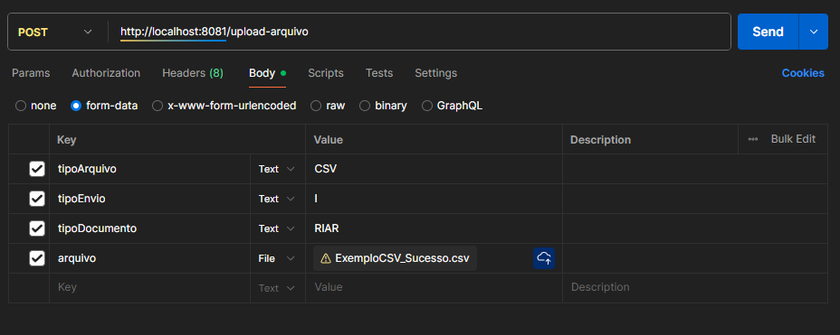

# Como testar?

Nosso sistema funciona com uma definição de Layout para possibilitar ao usuário envio de arquivos com colunas personalizadas. O sistema tem um padrão original que pode ser visto por meio da endpoint GET Layout: 
"http://localhost:8081/layout/RIA-R". Para que o sistema possa ler as colunas com nome personalizado, o layout deve ser alterado.

ATENÇÃO!! TODOS OS ARQUIVOS DESSA PASTA ESTÃO DE ACORDO COM O LAYOUT ATUALIZADO!! O LAYOUT DEVE SER ATUALIZADO POR MEIO DA ENDPOINT PUT Layout:
"http://localhost:8081/layout/RIA-R"
 
Os arquivos que terminam com a tag "_Erro" são aqueles que serão enviados ao microsserviço error-tracker, por não se encaixarem em dados válidos para envio ao RNDS. Exemplo: Arquivos sem identificadores de profissionais/ indivíduos.

Os arquivos que terminam com a tag "_Sucesso" são aqueles que serão enviados ao microsserviço RNDS Sender, e são válidos para envio. 

Os arquivos que terminam com tag "_Invalido" são aqueles que possuem erro de Layout. Esses arquivos não serão enviados ao file-processor. 

Para fazer o upload dos arquivos, as configurações devem ser alteradas de acordo com a imagem:

Para fazer uploads de csv, o tipoArquivo deve ser "CSV", e o arquivo selecionado deve ser carregado no "arquivo".

Para uploads de XLS, tipoArquivo deve ser "XLS", e arquivo selecionado deve ser carregado no "arquivo"

Para uploads de XLSX, tipoArquivo deve ser "XLSX", e arquivo selecionado deve ser carregado no "arquivo"
